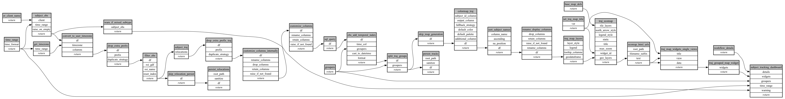

```
# AUTOGENERATED BY ECOSCOPE-WORKFLOWS; see fingerprint in README.md for details

```

```yaml
# fingerprint:
artifacts_sha256_basic: 5cda726876744403a0bdc8c66c500d855ac6248ffd6ee87dce60403f562be651
artifacts_sha256_strict: ca422ccec67d1af31a973a7cb6b30d9e5147519b30a3afe398802b26ea17218a
installed_requirements:
- channel: https://repo.prefix.dev/ecoscope-workflows/
  name: ecoscope-workflows-core
  version: {version: ==0.19.3}
- channel: https://repo.prefix.dev/ecoscope-workflows/
  name: ecoscope-workflows-ext-ecoscope
  version: {version: ==0.20.2.dev11+g37295c202.d20260110}
- channel: https://repo.prefix.dev/ecoscope-workflows-custom/
  name: ecoscope-workflows-ext-custom
  version: {version: ==0.0.14.dev0+g3f451d57d.d20260110}
params_sha256: 5b67a71c8865bc36539e6f5b48fbbf3650cf12055d2f887518a48e4b5ae233c1
spec_sha256: 963c86967dbcb046f4eab09d10bcab42dc3edfa70a5d71520d3b91bc886a5542

```

# ecoscope-workflows-download-subjects-workflow


