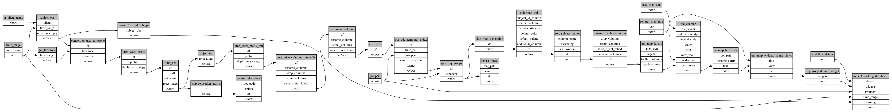

```
# AUTOGENERATED BY ECOSCOPE-WORKFLOWS; see fingerprint in README.md for details

```

```yaml
# fingerprint:
artifacts_sha256_basic: 5f4b36b27bb3f27e5ebcdf89073d34cad7f05418e3eefb4d8b927ea3a2fc8d01
artifacts_sha256_strict: 1674b6a7c861fa906dc7d6b566c44352e7d54fcae9f28fe7e92e55f7f8d82a77
installed_requirements:
- channel: https://repo.prefix.dev/ecoscope-workflows/
  name: ecoscope-workflows-core
  version: {version: ==0.22.18}
- channel: https://repo.prefix.dev/ecoscope-workflows/
  name: ecoscope-workflows-ext-ecoscope
  version: {version: ==0.22.18}
- channel: https://repo.prefix.dev/ecoscope-workflows-custom/
  name: ecoscope-workflows-ext-custom
  version: {version: ==0.0.45}
- channel: https://repo.prefix.dev/ecoscope-workflows-custom/
  name: pydeck
  version: {version: ==0.9.1a2}
params_sha256: 6912d74edc42423f7eb65c599c090af6a72419479c73d44ed243e4886a31525c
spec_sha256: 15bcc1b91a72885728a1b93372d1bd465470af4e4d02463ab2851fad0a50df3d

```

# ecoscope-workflows-download-subjects-workflow


