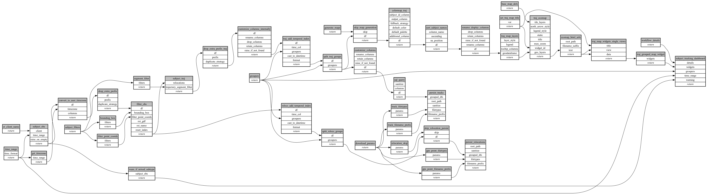

```
# AUTOGENERATED BY ECOSCOPE-WORKFLOWS; see fingerprint in README.md for details

```

```yaml
# fingerprint:
artifacts_sha256_basic: 3313aadff566aacd5ee5fef707101fdee6888ed390ca064dd68688b7acd02496
artifacts_sha256_strict: f4fa8bc9cd494ce01f193444ac4e84f31db97938d338ea55725b78be20e96890
installed_requirements:
- channel: https://repo.prefix.dev/ecoscope-workflows/
  name: ecoscope-platform
  version: {version: ==2.18.0}
- channel: conda-forge
  name: pydeck
  version: {version: ==0.9.2}
params_sha256: 36b6a43aa00f2d8f297059762d0401e715aa72b3c2e99a23b290baab907e0197
spec_sha256: b974be102ac7c7b3894159672b74ce93aca405d3eb7bfdf2056d33645279136a

```

# ecoscope-workflows-download-subjects-workflow


